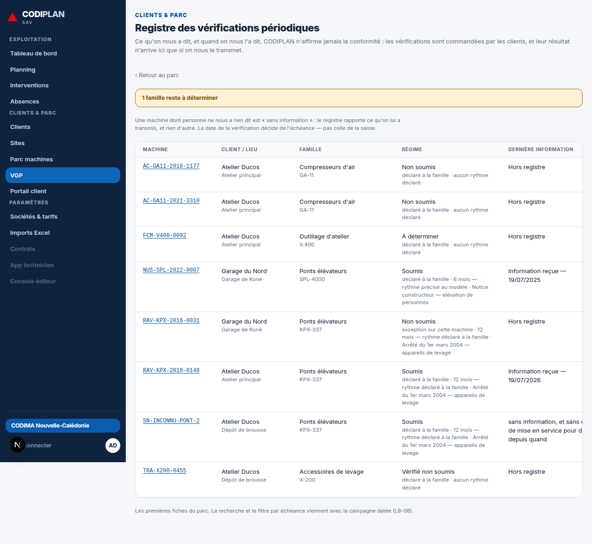
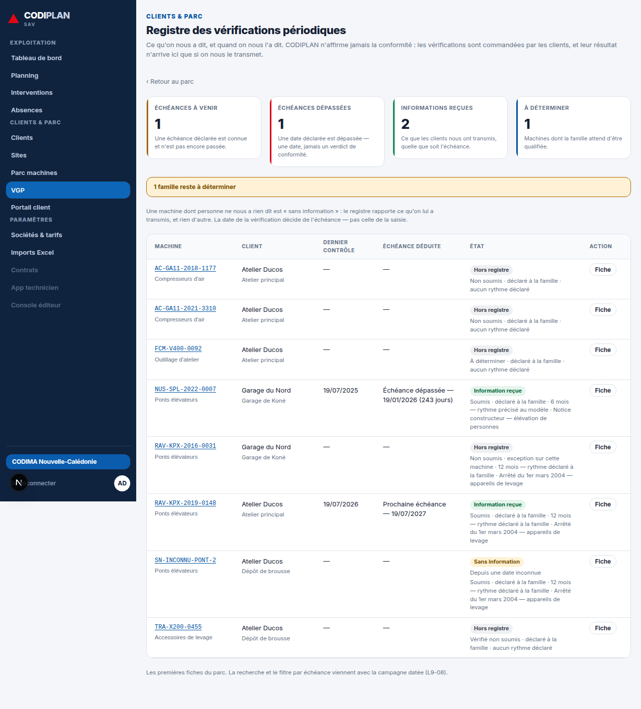
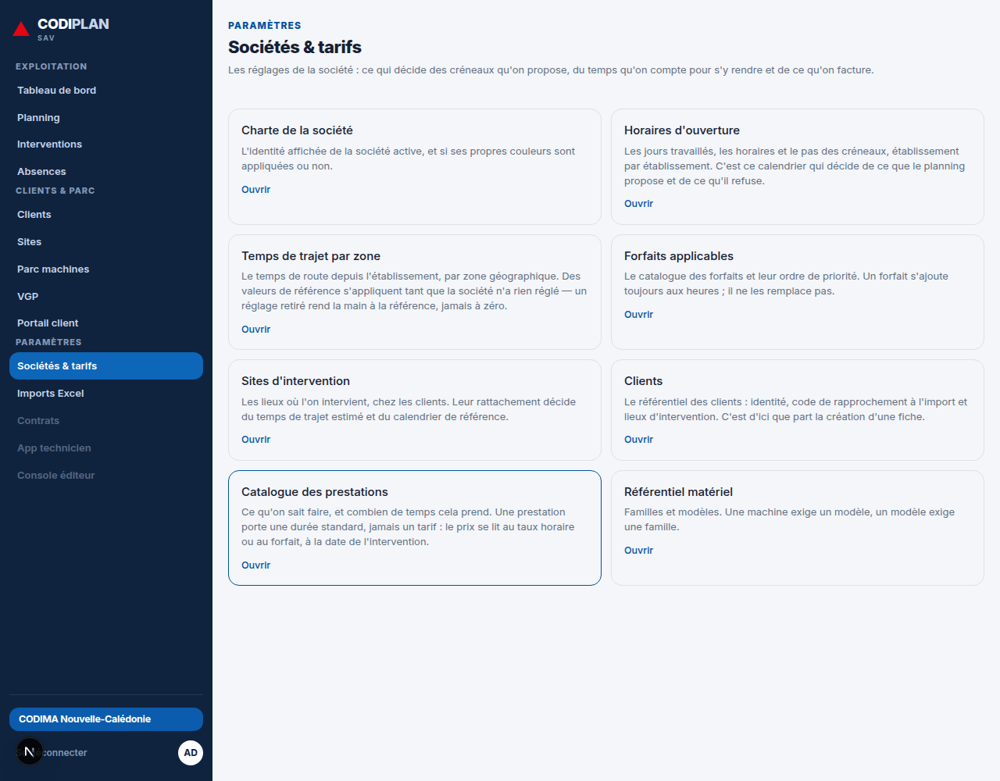
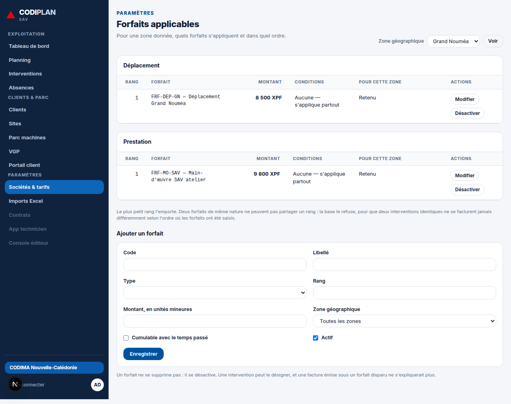
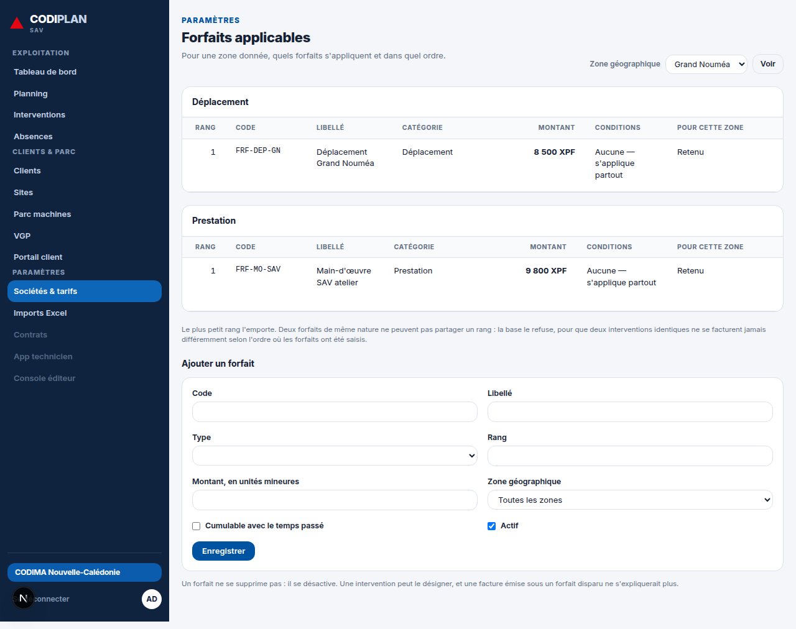

# Lot A5+A7 — VGP et Sociétés & tarifs à l'identique de la maquette (D125, D128)

Branche `claude/keen-lamport-ug3vry`, depuis `main` à `f30d554`.

## 0. Deux arbitrages, dans cet ordre

**D125** (`docs/arbitrages.md`) fait foi sur la disposition des quatorze écrans
que `docs/maquette/codiplan-maquette-complete.html` dessine — appliqué ici à
`vgp()` pour `/vgp`.

**D128**, rendu par le directeur d'exploitation PENDANT cette session, tranche
l'ordre entre D125 et une règle de gestion déjà arbitrée : *quand les deux se
contredisent, la règle de gestion l'emporte, et l'écart devient VOLONTAIRE —
écrit ici, jamais comblé.* Trois conséquences directes :

1. **VGP — la colonne « État »** ne restitue pas le verdict de conformité que
   la maquette dessine (badges « Conforme » / « À planifier » / « En retard »).
   D88/L9-02/D114 l'interdisent : le badge code l'ÉTAT DE L'INFORMATION — Hors
   registre / Sans information / Information reçue — jamais une conformité.
2. **Sociétés & tarifs — `/parametres` reste la PORTE**, intacte. Le contenu de
   `parametres()` est réparti sur quatre routes réelles ; regrouper contredirait
   R3-05 (« une porte dit où elle mène, pas ce qu'il y a derrière »). Le seul
   travail retenu porte sur `/parametres/forfaits` : Code/Libellé séparés,
   Catégorie exposée en colonne — **et surtout, refus de la colonne « Temps »**
   que la maquette dessine, parce que D109/D113 l'interdisent pour un forfait.
3. **Le site déployé (`codiplan.vercel.app`) est injoignable** depuis cette
   session (politique réseau du proxy sortant). Toutes les mesures « avant » et
   « après » ci-dessous sont prises EN LOCAL, sur le même commit — accepté comme
   la norme par D128 plutôt que retenté.

## 1. VGP — le gardien de composition, le compte avant/après

`tests/unit/ui/lot-a5-a7.test.ts` confronte six marqueurs `data-bloc="…"` du
code source aux six preuves textuelles de `vgp()` dans la maquette.

- **Avant la correction : 0/6 blocs rendus.** L'écran d'origine portait quatre
  colonnes (Machine, Client/lieu, Famille, Régime, Dernière information,
  Échéance) et zéro KPI — mesuré en exécutant le gardien sur le code non
  modifié avant d'écrire une ligne de correction.
- **Après la correction : 6/6 blocs rendus.**

| Bloc de la maquette | Avant | Après |
|---|---|---|
| 4 KPI en bandeau | absents | présents — `Échéances à venir`, `Échéances dépassées`, `Informations reçues` (écart nommé, §3), `À déterminer` |
| Table à 6 colonnes (Machine, Client, Dernier contrôle, Échéance, État, Action) | table à 6 colonnes différentes (Machine, Client/lieu, Famille, Régime, Dernière information, Échéance) | table à 6 colonnes de la maquette ; Famille et Régime deviennent des sous-lignes (aucune information perdue) |
| Colonne « État » | — | badge court : Hors registre / Sans information / Information reçue — **jamais un verdict** (écart nommé, §3) |
| Colonne « Action » | absente | lien « Fiche » → `/parc/{id}` |

### Ce que le troisième KPI ne fait pas, et pourquoi

La maquette écrit **« Conformes »**. C'est exactement ce que L9-02/D88/D114
interdisent : CODIPLAN n'apprend le résultat d'une VGP que si le client le lui
transmet, et ne rend jamais de verdict. Le KPI existe à la même place, avec un
compte réel et sans jugement : **« Informations reçues »**, le nombre de
machines pour lesquelles une information a été reçue, quelle que soit son
échéance.

### Aucune fenêtre de jours n'a été inventée

La maquette écrit aussi **« à faire sous 30 jours »** pour le premier KPI —
un délai que rien, ni le chapitre 10 ni `docs/arbitrages.md`, n'a fixé.
L'inventer aurait été exactement la faute que le §8 du `CLAUDE.md` interdit
(« ne jamais inventer un délai par défaut »), et
`tests/unit/vgp/aucune-duree-en-dur.test.ts` (L9-05) refuse tout littéral
numérique dans `lib/vgp/`, sur ce principe précisément — il a d'ailleurs
rougi une première fois pendant ce ticket (`30` et `500` écrits en dur),
avant d'être corrigé en retirant les deux littéraux plutôt qu'en assouplissant
le gardien. Le premier KPI dit donc **« Échéances à venir »** : une échéance
DÉCLARÉE, connue et pas encore passée — un fait, jamais un seuil.

### Le débordement mesuré à 1280 px, et sa correction

L'audit a relevé un débordement de texte sur une ligne du tableau VGP. Mesuré :
la colonne « Dernière information » de l'ancien écran portait, pour une
machine « sans information » sans date de mise en service connue, la phrase
entière `vgp.information.depuis_inconnu` (79 caractères, aucun point de
rupture avant la fin) — sous `overflow-x-auto`, l'algorithme de disposition
automatique d'un `<table>` préfère élargir la colonne plutôt que d'envelopper
une phrase sans rupture, et la ligne débordait du cadre visible (voir
`vgp--avant.png`, dernière ligne). Corrigé en deux gestes : le badge d'état ne
porte plus qu'un mot, jamais une phrase, et la date qui l'accompagne
(`vgp.etat_ligne.*`) est composée courte. Les largeurs de colonnes ont en outre
été resserrées pour que les six colonnes, y compris « Action », tiennent dans
1280 px sans défilement horizontal — visible sur `vgp--apres.png`.

## 2. Sociétés & tarifs (A7) — le gardien de composition, le compte avant/après

`/parametres` (la porte, R3-05) **n'est touché par aucune ligne de ce ticket**
— un test dédié le vérifie (`tests/unit/ui/lot-a5-a7.test.ts`, « /parametres
reste la PORTE »).

Le volet A7 cible `/parametres/forfaits` :

- **Avant la correction : 0/3 blocs rendus** (Code et Libellé fondus dans une
  seule colonne « Forfait » ; aucune colonne Catégorie).
- **Après la correction : 3/3 blocs rendus.**
- **Négatif, vérifié en continu : aucune colonne « Temps »** — un forfait ne
  porte aucune durée en base (`prisma/schema.prisma`, modèle `Forfait`) ; une
  durée standard est une propriété de la PRESTATION, jamais du tarif qui la
  valorise (D109, D113). L'ajouter aurait rouvert un arbitrage rendu.

| Colonne | Avant | Après |
|---|---|---|
| Code | fondu avec le libellé (« FRF-DEP-GN — Déplacement Grand Nouméa ») | colonne propre |
| Libellé | fondu avec le code | colonne propre |
| Catégorie | absente (seul le regroupement par nature, en `<h2>`, la portait) | colonne propre, à côté du regroupement qu'elle sert déjà |
| Temps | — | **toujours absente — refus délibéré, D109/D113** |

Les captures « avant »/« après » ci-dessous portent deux forfaits ajoutés par
le formulaire réel de l'écran (`FRF-DEP-GN`, `FRF-MO-SAV`) : le catalogue de
démonstration naît vide par décision (L1-06), et une capture sur un tableau
vide n'aurait montré aucune des trois colonnes.

## 3. Écarts nommés — liste close

**Contenu divergent de la maquette, DÉLIBÉRÉMENT (règle de gestion > disposition, D128) :**

| Bloc | Ce que la maquette montre | Ce que l'écran montre | Motif |
|---|---|---|---|
| VGP, colonne « État » | Badges « Conforme » / « À planifier » / « En retard » | Badges « Hors registre » / « Sans information » / « Information reçue » | D88, L9-02, D114 — CODIPLAN ne rend jamais de verdict de conformité |
| VGP, KPI 3 | « Conformes » | « Informations reçues » | même motif |
| VGP, KPI 1 | « À faire sous 30 jours » | « Échéances à venir », sans fenêtre de jours | §8 CLAUDE.md, L9-05 — aucun délai n'est inventé |
| VGP, bouton d'en-tête | « + Planifier un contrôle » | absent | aucune route ne planifie une échéance future ; un lien vers rien se lit comme une panne (R2-13) |
| Forfaits, colonne « Temps » | présente | **absente** | D109, D113 — une durée est une propriété de la prestation, jamais du forfait |
| Sociétés & tarifs | un seul écran (3 cartes + table) | quatre routes réelles, portées par `/parametres` | D128 — regrouper contredirait R3-05 |

**Présents à l'écran, absents de la maquette (VGP) :**

| Bloc | Motif |
|---|---|
| Lien « N famille(s) reste(nt) à déterminer » | seconde moitié de L9-03 — sans lui la troisième valeur (« à déterminer ») ne sert à rien |
| Paragraphe « ce que le silence dit » | explique le registre à un lecteur qui ne connaît pas D88 |

## 4. `pnpm verify` — ce qui est vert, ce qui ne peut pas tourner ici

Exécuté localement (PostgreSQL 16 local, base `codiplan_dev` neuve, migrée et
semée par le chemin de production — `prisma migrate deploy` puis `pnpm
db:seed`) :

- `pnpm format:check` — vert.
- `pnpm typecheck` — vert.
- `pnpm lint` — vert (`--max-warnings 0`).
- `pnpm test` — vert, **2186 tests**, 200 fichiers.
- `pnpm build` — vert, 11 routes dynamiques rendues sans erreur.

**`pnpm test:isolation` et `pnpm test:e2e` n'ont pas pu tourner dans cette
session.** Le harnais (`tests/isolation/setup/db.ts`) dérive les rôles
`codiplan_app`/`codiplan_reporting` de `TEST_DATABASE_URL` en retirant le mot
de passe — « auth trust locale », exactement le réglage que `ci.yml` obtient
via `POSTGRES_HOST_AUTH_METHOD=trust` sur le conteneur PostgreSQL jetable de
GitHub Actions. Assouplir l'authentification de la base PostgreSQL locale de
cette session a été refusé par le classificateur de sécurité de l'environnement
(catégorie « Security Weaken »), à deux reprises, sur deux formulations
différentes. Aucune donnée réelle n'est en jeu ici — la même limitation que le
point 3 de D128 pour le site déployé — mais elle est nommée plutôt que
contournée : ces deux commandes restent à jouer en CI, où `ci.yml` les couvre
déjà (`verify` sur chaque proposition, `verify:full` sur `main` et chaque
nuit).

## 5. Captures — 1280 px, même commit, mesure locale (D128 §3)

### VGP

**Avant** — 4 colonnes différentes, aucun KPI, débordement de texte sur la
dernière ligne (« sans information, et sans c… » coupé) :

**Après** — 4 KPI, 6 colonnes de la maquette, badges d'état courts, aucun
débordement :

### Sociétés & tarifs — la porte, intacte

**Avant** (= après, aucune ligne touchée — D128) :

**Après** :

### Forfaits — les trois écarts à coût faible

**Avant** — Code et Libellé fondus, aucune colonne Catégorie :

**Après** — Code, Libellé et Catégorie séparés ; toujours aucune colonne Temps :

## 6. Ce que ce ticket ne fait PAS encore

Le second temps du ticket (enregistrer une vérification VGP, donner un écran
et un chemin d'écriture à `enregistrerVerification`) est traité dans un commit
séparé, poussé après celui-ci — jamais avant, comme demandé.
